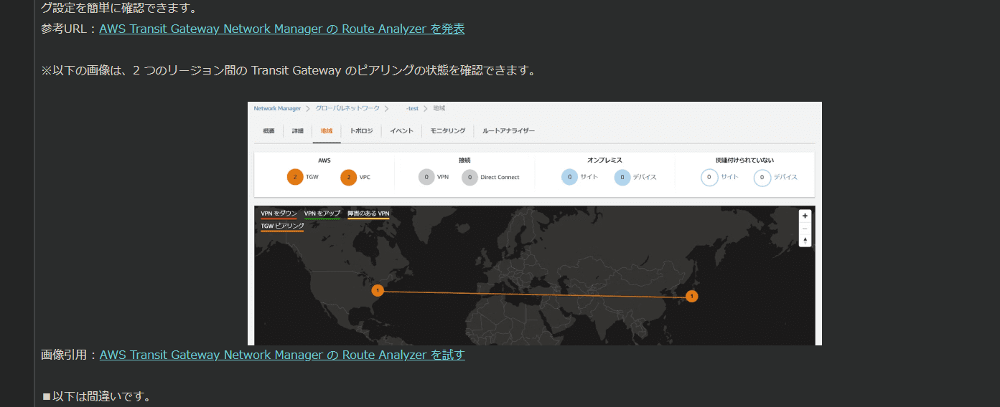
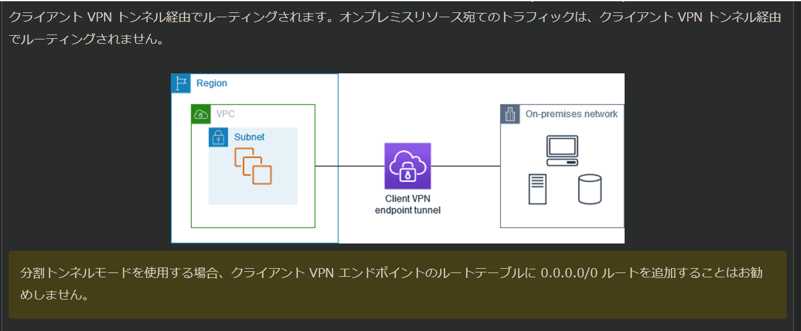

# ANS20

- 複数の1Gbps AWS Direct Connect接続を使用してトータルで、4Gpbsの帯域幅を提供する。DXゲートウェイとTransit Gatewayの組み合わせは複数のVPCが相互に接続できるようにするための効果的な方法。
   TGWを使用すると、すべてのVPCトラフィックを一元的にルーティングし、承認されたＦＷを検査ＶＰＣにデプロイすることでトラフィックを適切にフィルタリングできる

- プライベートNATGW
  プライベートNATGWを使用すると、プライベートNATGWを介してほかのVPCまたはオンプレミスのネットワークに接続することができる。

- そもそも、許可されたIPアドレス範囲の一部を使用する必要がある。

- SaaS企業が、VPNトンネルを使用して複数のDCに接続する数百の客がいる
   複雑なNATルールが前提条件
   客はVPCから直接SaaSにアクセスする必要がある＋オンプレの人はIPsecで暗号化されたトンネルを経由して接続する必要がある。
  　→　PrivateLinkで実装する必要がある

- TGWはIPv4とIPv6の両方をサポートしているのでIPv6アドレスを使用してVPCリソースに接続する必要があるオンプレミスリソースにも対応できる

- Client VPCエンドポイントのルートテーブルにルートを追加することで特定のトラフィックをVPC Bにルーティングできる。
  

- VPCでは、デフォルトのAmazon提供用のDNSが提供され、このDNSは既にVPC内のリソースに対してDNS解決を提供する。

# ANS21　

- TGW Network ManagerはRoute Analyzer機能はルートの分析ミスの特定に直接使用できる機能である
 詳しくは・・AWSのネットワークアーキテクチャにおいて、ルーティングポリシーを視覚的に表示して、トラフィックフローを模擬して構成のミスや欠如しているルートを特定できる機能

- 非対称ルーティングを許可　（VPNのルーティング）
   CGW状の仮想トンネルインターフェースを設定して非対称ルーティングを許可することで戻りトラフィックが2番目のトンネル経由で受信されてもドロップされない　ってなる

　注：**アクティブアクティブ設定では、カスタマーゲートウェイで仮想トンネルインターフェースで非対称ルーティングをアクティブ化は必要**

- VPCフローログでは、IPトラフィックのフロー情報を取得できるが、TCPセグメントのペイロード情報を取得できない

- AS_PATH属性を利用してトラフィックのルーティングを調整することができる
   BGPがAS_PATH属性が短い（つまり、経由するASが少ない）ルートを優先して選ぶという特性を利用した方法

  通常時は、5Gbpsのルート（AS_PATHが短い）障害時は2Gbosのルートが選ばれ、問題文の要件を満たす

- Resource Access Managerを使用して、アカウント間でRoute53のResolverのルールを共有することができる

# ANS22

- DNSSEC署名の設定
   Route53でDNSSECを有効にすることで、DNSデータの認証と整合性を確保できる。KMSを用いてキー署名キー（KSK）を作成することで、安全なカギ管理が可能となる。

- 親ゾーンに委任署名者レコードを追加して、ホストゾーンの信頼チェーンを作成する

- Link Aggregation Group (LAG)
   複数の接続を使用して、利用できる帯域幅を増やすことができる。LAGはコントロールプロトコルを使用して、1つのDXのエンドポイントに集約してそれらを1つのマネージド型接続として、扱うことを可能にする論理インターフェース。 LAG設定はグループ内のすべての接続に適用されるため、合理化である

# ANS23

- Client VPNエンドポイントで分割トンネルオプションを有効
 上記を実行すると、Client VPNエンドポイントルートテーブルからのルートと一致するネットワークへの送信先をもつトラフィックだけが、Client VPNトンネル経由でルーティングされ、それ以外のリモートユーザのインターネットトラフィックはClient VPNを経由しなくなる

- TGW同士をピアリングすることで、フェイルオーバ機能も確保される

**知識として覚えておくこと**

1. DXGWと、TGWの併用構成には必ずTransit VIFが必要になる。
2. Transit VIFを取り扱っているかどうかをネットワーク回線事業会社に確認する
3. 新規にDXGWを用意する必要がある。
4. DXGWの許可されたプレフィックスを利用して通信経路を制御する
5. 非対称ルーティングが発生しても、正常に通信ができるかをネットワーク回線事業者に確認する

覚えておくこと

- ClientVPNのおさらい
 メリット：セットアップが簡単
 Client VPNのセットアップはルータなどのネットワーク機器を操作する必要がない。 Client VPN関連のリソースと、クライアント端末上の設定のみで完結する。実装するにあたって証明書の発行は必要になる。ACM使ってインポートはできる。
 インターネット接続があれば、できる。

| 項目        | Client VPN        | Site-to-Site       |
|-------------|--------------------|--------------------|
| 利用する技術     | VPN             |IPsec           |
| 基盤ネットワーク    | インターネット    | インターネット、閉域   |
| 接続   | クライアントとネットワーク拠点間    | ネットワーク拠点同士   |
| 用途   | リモート端末からの社内LANアクセス   |拠点間のセキュアなネットワーク接続   |

# ANS24

- VPCでIPアドレスが枯渇する問題について
   Amazon VPC IP Address Manager (IPAM)はIPアドレスの使用状況を組織的に監視して管理するため設計されている。
   トップレベルプールと各VPCプール、さらにはサブネットプールを作成することで、VPC内のリソース全体のIPアドレス使用量に対して非常に詳細なモニタリングが可能になる。
   CloudWatchAlarmも利用して、可用性制限の閾値に達した場合にSNSで通知することもできる。

- Global Accelerator の背後に複数のオリジンを配置することができる。エンドポイントのフェイルオーバやスケーリング、A/Bテスト、B/Gデプロイなどもできる。
- 各エンドポイントに対して重みづけもでき、送信されるトラフィックの量を調整することもできる。
アプリケーションの保護
Global Accelerator を利用することで、オリジンとなる ALB や EC2 に対してパブリックなインターネットからのアクセスを防ぐことができるため、アプリケーションに対する攻撃リスクを低減することができます。

Global Accelerator を利用する際、各オリジンに対してどの様なネットワーク構成にするのがセキュアかについては以下ブログにまとめられていますので、一読していただければと思います。

- 既存のNLBでglobal accelerator
  →　データ転送の高速化と信頼性の向上

Route53のフェイルオーバルーティングポリシーでは、可用性の確保を目的とする。UDPのようにパケットが頻繁にドロップする可能性のあるケースでは効果がない

CloudFrontも同様で、HTTP/HTTPSではトラフィックの高速配信に特化できるが、UDPトラフィックをサポートしているわけではない

# ANS31

1. 　パブリック仮想インターフェースプレプレフィックスアドバタイズルール  
→  
2.HTTPステータスコード502  
  →　CloudFrontがオリジンサーバに接続できないためになるエラー。

  SSL/TLS交換の暗号化またはプロトコルをサポートしていない

# ANS32

1.  アプリケーションがクライアントの証明書を要求し、最初のハンドシェイクの一部として証明書を検証する。
2.  

# ANS33

1.　アプリは負荷を処理するためにスケーリングする必要があり、  
  クライアント証明書を利用してウェブサーバで直接認証する必要がある

  ※ALB,NLBの使い分け

# ANS34
トンネルBよりも、トンネルAを優先するように、Site-to-SiteVPN接続の設定
　→　　アクティブパッシブ構成にすることで、トンネルAに対してより具体的になり、
プレフィックスをアドバタイズすることで、企業の要件に対応できる

アクティブ/アクティブ設定時の動き
　→　カスタマーゲートウェイで仮想トンネルインターフェースで非対称ルーティングをアクティブ化することが必要となる。

プライベートゲートウェイを指す
プレフィックスがないとき、トラフィックを」ルーティングができない。

NLBを使用した時、IPアドレスは引き継げない
→　クライアントIPを保持することはできない。

# ANS35

ClientVPNを使用して、開発者がリモートでVPC内のリソースにアクセスできるようにするため

ユーザはクライアントVPNを使用してリモート開発用のコンピュータからElasticsearch

# ANS36

Global Accelerator
 →　地理的な位置に基づいて、ユーザトラフィックを適切なリージョンに自動的にルーティングしてくれる。

 **Global Accelerator**は、リクエストを最適な、エンドポイントにリダイレクトする際に、自動フェールオーバー機能を備えた静的IPアドレスを提供する。

 GuardDutyは、最小限の操作でDNSリクエストとVPCフローログを検査することができる。
 トラフィックパターンを分析することができる。

 S3ログ、CloudTrailログ、DNSログ、EBSボリューム

# ANS37

TransitGatewayとVPCピアリングを実装するときの考慮

MACsecを使用した、10GB DirectConnect接続より、最小の運用オーバヘッドで高速暗号化が提供されるため

ALBを使用して、インターネットアプリケーションを大規模に「安全に公開する方法と、PrivateLink

セキュリティグループはAmazon DNSサーバへのアウトバウンドトラフィックをフィルタリングすることはできない

# ANS38

DXとSite to SiteVPNを使用すると、DX専用ネットワーク接続を１つ以上とVPCVPNを組み合わせることが出きる

192.168.224.0/19 192.168.128.0/17 CIDRは　もちろんかぶっているので、Trqansit Gatewayやピアリングは使えない
VPCエンドポイントサービスを作成して、推奨ウェブサービスを本番環境に公開することができるため、正解

# ANS39
- 既存の専用接続の帯域幅をアップグレードすることはできないため、間違い

- Resolver DNS Firewallの」VPC構成を更新して、フェールオープンを有効にすることで、Firewallからの応答を受信しない場合にも、Resolverがクエリを通過させることができるため正解

- NATGWが350秒以上のアイドル状態の接続をドロップするため、正解
  
  →　解決策：接続が中断されないように、接続を介して追加のトラフィックを開始することができる
。またはインスタンスで350秒未満の値でTCPキープアライブを有効にすることで解決できる。  　
- 既存インターネット接続を利用したVPNが安全かつ、費用対効果の高い方法で、オンプレミスのＶＭをＡＷＳクラウドに移行することができるため

- スプリットDNSとは？
  　 DNSクエリ送信元によって、異なるDNS情報のセットを提供する機能をスプリットビューDNSといいます。

# ANS40

- ALBのセキュリティポリシーを、Forward Security をサポートするポリシーに変更することで、一意のランダムセッションキーを使用して、暗号化されたデータの盗聴に対する追加の保護手段を提供

- デッドピア検出（DPD）はネットワークの状態によってインターネット上でのパケット配信ができなくなった場合に、VPNデバイスが迅速に特定できるようにする
  
- ICMPリクエストは、一定の双方向のリクエストを投げかける