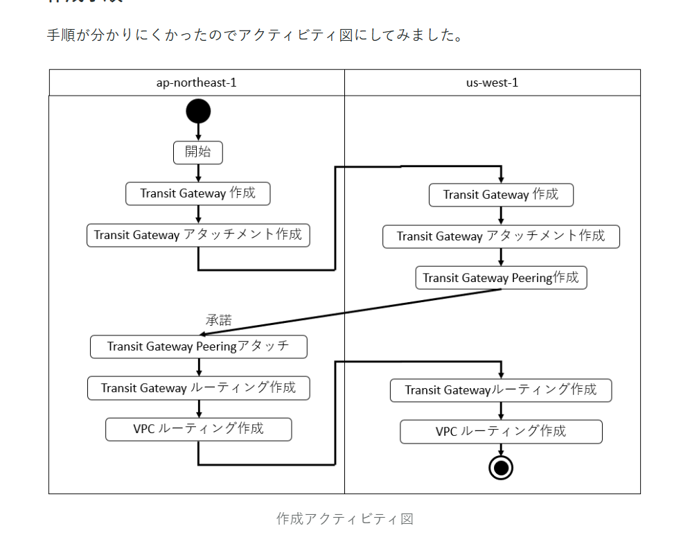
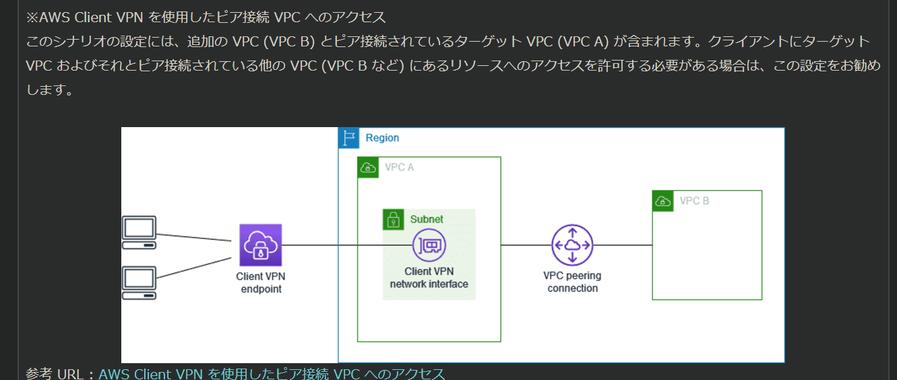
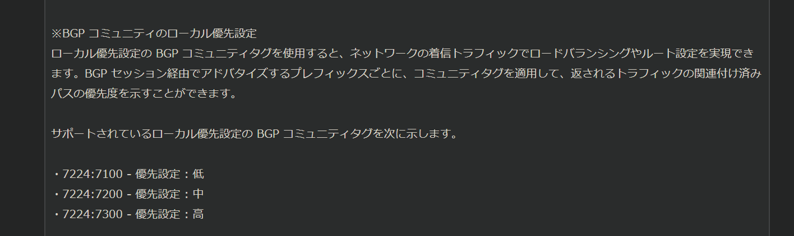

# ANS20

- 複数の1Gbps AWS Direct Connect接続を使用してトータルで、4Gpbsの帯域幅を提供する。DXゲートウェイとTransit Gatewayの組み合わせは複数のVPCが相互に接続できるようにするための効果的な方法。
   TGWを使用すると、すべてのVPCトラフィックを一元的にルーティングし、承認されたＦＷを検査ＶＰＣにデプロイすることでトラフィックを適切にフィルタリングできる

- プライベートNATGW
  プライベートNATGWを使用すると、プライベートNATGWを介してほかのVPCまたはオンプレミスのネットワークに接続することができる。

- そもそも、許可されたIPアドレス範囲の一部を使用する必要がある。

- SaaS企業が、VPNトンネルを使用して複数のDCに接続する数百の客がいる
   複雑なNATルールが前提条件
   客はVPCから直接SaaSにアクセスする必要がある＋オンプレの人はIPsecで暗号化されたトンネルを経由して接続する必要がある。
  　→　PrivateLinkで実装する必要がある

- TGWはIPv4とIPv6の両方をサポートしているのでIPv6アドレスを使用してVPCリソースに接続する必要があるオンプレミスリソースにも対応できる

- Client VPCエンドポイントのルートテーブルにルートを追加することで特定のトラフィックをVPC Bにルーティングできる。
  

- VPCでは、デフォルトのAmazon提供用のDNSが提供され、このDNSは既にVPC内のリソースに対してDNS解決を提供する。

# ANS21　

# ANS31

1. 　パブリック仮想インターフェースプレプレフィックスアドバタイズルール  
→  
2.HTTPステータスコード502  
  →　CloudFrontがオリジンサーバに接続できないためになるエラー。

  SSL/TLS交換の暗号化またはプロトコルをサポートしていない

# ANS32

1.  アプリケーションがクライアントの証明書を要求し、最初のハンドシェイクの一部として証明書を検証する。
2.  

# ANS33

1.　アプリは負荷を処理するためにスケーリングする必要があり、  
  クライアント証明書を利用してウェブサーバで直接認証する必要がある

  ※ALB,NLBの使い分け

# ANS34
トンネルBよりも、トンネルAを優先するように、Site-to-SiteVPN接続の設定
　→　　アクティブパッシブ構成にすることで、トンネルAに対してより具体的になり、
プレフィックスをアドバタイズすることで、企業の要件に対応できる

アクティブ/アクティブ設定時の動き
　→　カスタマーゲートウェイで仮想トンネルインターフェースで非対称ルーティングをアクティブ化することが必要となる。

プライベートゲートウェイを指す
プレフィックスがないとき、トラフィックを」ルーティングができない。

NLBを使用した時、IPアドレスは引き継げない
→　クライアントIPを保持することはできない。

# ANS35

ClientVPNを使用して、開発者がリモートでVPC内のリソースにアクセスできるようにするため

ユーザはクライアントVPNを使用してリモート開発用のコンピュータからElasticsearch

# ANS36

Global Accelerator
 →　地理的な位置に基づいて、ユーザトラフィックを適切なリージョンに自動的にルーティングしてくれる。

 **Global Accelerator**は、リクエストを最適な、エンドポイントにリダイレクトする際に、自動フェールオーバー機能を備えた静的IPアドレスを提供する。

 GuardDutyは、最小限の操作でDNSリクエストとVPCフローログを検査することができる。
 トラフィックパターンを分析することができる。

 S3ログ、CloudTrailログ、DNSログ、EBSボリューム

# ANS37

TransitGatewayとVPCピアリングを実装するときの考慮

MACsecを使用した、10GB DirectConnect接続より、最小の運用オーバヘッドで高速暗号化が提供されるため

ALBを使用して、インターネットアプリケーションを大規模に「安全に公開する方法と、PrivateLink

セキュリティグループはAmazon DNSサーバへのアウトバウンドトラフィックをフィルタリングすることはできない

# ANS38

DXとSite to SiteVPNを使用すると、DX専用ネットワーク接続を１つ以上とVPCVPNを組み合わせることが出きる

192.168.224.0/19 192.168.128.0/17 CIDRは　もちろんかぶっているので、Trqansit Gatewayやピアリングは使えない
VPCエンドポイントサービスを作成して、推奨ウェブサービスを本番環境に公開することができるため、正解

# ANS39
- 既存の専用接続の帯域幅をアップグレードすることはできないため、間違い

- Resolver DNS Firewallの」VPC構成を更新して、フェールオープンを有効にすることで、Firewallからの応答を受信しない場合にも、Resolverがクエリを通過させることができるため正解

- NATGWが350秒以上のアイドル状態の接続をドロップするため、正解
  
  →　解決策：接続が中断されないように、接続を介して追加のトラフィックを開始することができる
。またはインスタンスで350秒未満の値でTCPキープアライブを有効にすることで解決できる。  　
- 既存インターネット接続を利用したVPNが安全かつ、費用対効果の高い方法で、オンプレミスのＶＭをＡＷＳクラウドに移行することができるため

- スプリットDNSとは？
  　 DNSクエリ送信元によって、異なるDNS情報のセットを提供する機能をスプリットビューDNSといいます。

# ANS40

- ALBのセキュリティポリシーを、Forward Security をサポートするポリシーに変更することで、一意のランダムセッションキーを使用して、暗号化されたデータの盗聴に対する追加の保護手段を提供

- デッドピア検出（DPD）はネットワークの状態によってインターネット上でのパケット配信ができなくなった場合に、VPNデバイスが迅速に特定できるようにする
  
- ICMPリクエストは、一定の双方向のリクエストを投げかける